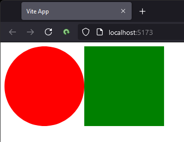
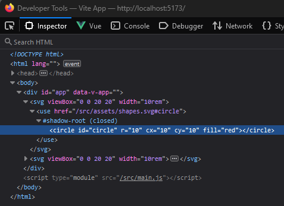
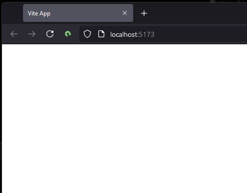
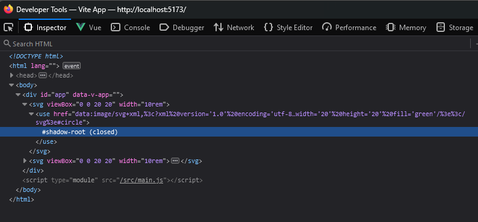

# vite-6-breaks-svg

I updated one of my work projects to Vite 6 and all the images in SVG tags disappeared.
If I move Vite back to 5.4.9 or later, which is where I was prior to updating my project, the SVGs come back.
Here is an example project which demonstrates this.

## Project

I created a project using `npm create vue@latest` and removed most of the default project files (i.e., very little is left in `/src`). 
At this point, it just displays a couple SVGs.
Here's the most relevant files:

`src/vite.config.js` 👈 Unchanged from when project was created
```javascript
import vue from '@vitejs/plugin-vue'
import { fileURLToPath, URL } from 'node:url'

import { defineConfig } from 'vite'

// https://vite.dev/config/
export default defineConfig({
    plugins: [
        vue()
    ],
    resolve: {
        alias: {
            '@': fileURLToPath(new URL('./src', import.meta.url))
        },
    },
})
````
    
`src/assets/shapes.svg`
```svg
<?xml version="1.0" encoding="utf-8"?>
<svg viewBox="0 0 20 20" xmlns="http://www.w3.org/2000/svg">
    <circle id="circle" r="10" cx="10" cy="10" fill="red"/>
    <rect id="square" x="0" y="0" width="20" height="20" fill="green"/>
</svg>
```

`src/App.vue`
```vue
<template>
    <svg viewBox="0 0 20 20" width="10rem">
        <use href="@/assets/shapes.svg#circle"/>
    </svg>
    <svg viewBox="0 0 20 20" width="10rem">
        <use href="@/assets/shapes.svg#square"/>
    </svg>
</template>
```

## Expectation

With Vite 5.4.11 we get this in Firefox (I've tested all this in Chrome too):



The developer tools shows this:



## Problem

If I change Vite to 6.0.0, or anything later, and <em>don't change anything else</em>, the shapes disappear:



The developer tools shows this:



## Comparison

It looks like Vite is not processing the file correctly.
If there's something I need to change in the Vite config, please let me know, but I haven't seen anything specific to this in the migration document or any other issue on Github.
Here's the developer tools side-by-side, but you can see the `<use href=` is very different and the tag doesn't seem to contain the path code anymore.

| Vite 5.4.11                                                | Vite 6.0.3                                                |
|------------------------------------------------------------|-----------------------------------------------------------|
|    |    |
| ---------------------------------------------------------- | --------------------------------------------------------- |
